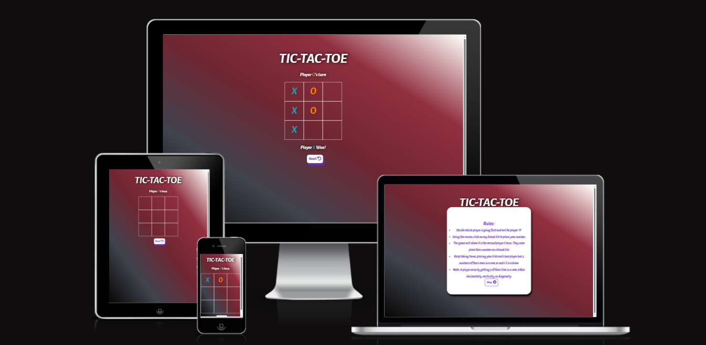

 # PP2-Tic-Tac-Toe

[live page](https://rayknezdev.github.io/PP2-Tic-Tac-Toe/) 

Tic Tac Toe is a classic two-player game where each player takes turns marking the spaces in a 3x3 grid with either an X or an O. The player who succeeds in placing three of their marks in a horizontal, vertical, or diagonal row wins the game.

## How to play

To play Tic Tac Toe, you need a 3x3 grid and two players. You can use a paper and a pencil, or any other materials that can create a grid and mark the spaces. Alternatively, you can play Tic Tac Toe online using a website or an app.

The rules of Tic Tac Toe are simple:

- The game starts with an empty grid.
- The first player chooses a space and marks it with an X.
- The second player chooses a different space and marks it with an O.
- The players take turns marking the spaces until one of them forms a row of three marks of the same type, or until all spaces are filled.
- If a player forms a row of three marks, they win the game.
- If all spaces are filled and no one forms a row, the game ends in a draw.

## Tips and strategies

Tic Tac Toe is a game of logic and strategy. Here are some tips to help you improve your skills:

- The center space is the most important one, as it is part of four possible rows. Try to mark it first, or prevent your opponent from doing so.
- The corner spaces are also valuable, as they are part of three possible rows. Try to mark them next, or block your opponent from forming a row with them.
- The edge spaces are the least useful, as they are part of only two possible rows. Avoid marking them unless you have no other choice, or you can win or block with them.
- If you have two marks in a row, try to complete the third one and win the game. If your opponent has two marks in a row, try to block them and prevent them from winning.
- If you have no immediate moves to win or block, look for forks. A fork is a position where you can create two possible rows with your next move, forcing your opponent to block one and leaving you free to complete the other.
- If your opponent creates a fork, try to block it by creating your own fork or by forcing them to defend. If you cannot do either, choose the space that blocks the most possible rows for your opponent.

## Fun facts

Tic Tac Toe is also known by other names, such as Noughts and Crosses, Xs and Os, or Tick Tack Toe. It is one of the oldest and most popular games in the world, dating back to ancient Egypt, Rome, and China. It is also related to other games, such as Connect Four, Gomoku, and Tic-Tac-Toe 3D.

Tic Tac Toe is a solved game, meaning that there is a known optimal strategy for both players that leads to a draw if followed correctly. The optimal strategy is based on the minimax algorithm, which evaluates all possible moves and chooses the best one based on the worst-case scenario.

Tic Tac Toe has many variations that make it more challenging and interesting. Some examples are:

- Ultimate Tic Tac Toe: A game where each space in the 3x3 grid contains another 3x3 grid. To win, you need to form a row of three grids where you have won the inner game.
- Quantum Tic Tac Toe: A game where each move consists of placing two marks in different spaces. The marks are in superposition until they are collapsed by forming a row with another mark.
- Misère Tic Tac Toe: A game where the goal is to avoid forming a row of three marks of your type. The player who does so loses the game.
  
## Colors

- Idea for color ratiofor background i used,  found at site Coolors.co 

## Fonts

- [Google](https://fonts.google.com/)- used to find inspiration about what font I could use.  

 # Features

 ## Pop-up Box
 
 
- First experience players can see is the pop up box, where they could renew their knowledge about rules of the game.

 # Header

 

- We could see the name of the game with second row explaining who is next to play.

 # Reset Button 

-At the bottom of the game board is a reset button. It allows players to start from begining. 

# Sound 

- Diferent Sound following Win or Tie result. I write it with the help of Bing AI chat box.

## User Stories
Sure, here are some user stories for a Tic Tac Toe game:

- As a user, I want to start a new game so that I can play Tic Tac Toe.
- As a user, I want to be able to choose between playing against the computer or another player so that I can have different levels of challenge.
- As a user, I want to be able to choose my symbol (X or O) so that I can have my personal preference.
- As a user, I want to see the game board after each turn so that I can understand the current state of the game.
- As a user, I want to be able to click on an empty square to make my move so that I can play the game.
-  As a user, I want the game to not allow invalid moves so that the game is fair and follows the rules.
- As a user, I want the game to notify me when someone has won, or if it's a draw so that I know the result of the game.
- As a user, I want an option to play again after the game is over so that I can enjoy multiple rounds of the game.
- As a user, I want the game to keep track of scores if I play multiple rounds so that it adds a competitive element to the game.

 ##  Technologies Used
  #  Languages Used
  
  HyperText Markup Language(HTML), Cascading Style Sheet(CSS), JavaScript(JS) were used to create this game.
  
  [Github](https://www.github.com/) - To save and store the files.
  
  [Google Fonts](https://fonts.google.com/)-To import the fonts.
  
  [Am I Responsive](http://ami./responsivedesign.is/)-To show games image on a range of devices

  # Deployment
  Github Pages was used to deploy live website. The instructions are below.
  Log in (or sign up) to Github.com. Find the repository for this project, rayknezdev/PP2-Tic-Tac-Toe.Click on the Settings link. 
  Click on the Pages link in the left hand side navigation bar. In the Source section, choose main from the drop down select 
  branch menu. Select Root from the drop down select folder menu. Your live Github Pages site is now deployed at the URL shown.

  ## Local development

   How to Fork?
   To fork the PP1 repository: 
   Log in (or sign up) to Github. Go to the repository for this project, https://github.com/rayknezdev/PP2-Tic-Tac-Toe.
   Click the Fork button in the top right corner.

  ## How to Clone
    To clone the PP1 repository:
  Log in (or sign up) to GitHub. Go to the repository for this project,https://github.com/rayknezdev/PP2-Tic-Tac-Toe. Click on the 
  code button, select whether you would like to clone with HTTPS, SSH or GitHub CLI and copy the link shown. Open the terminal in 
  your code editor and change the current working directory to the location you want to use for the cloned directory. Type 'git 
  clone' into the terminal and then paste the link you copied in step 3. Press enter.

  # Testing
  
    On completion the site was tested across multiple browsers and platforms. The site has been built using Chrome, therefore it was also tested across Microsoft Edge and Firefox for 
    desktops and larger screen sizes, whilst tested using Safari and Chrome on mobile and tablet devices.

    Screen Testing The site was screen tested for reponsiveness locally using Chrome developer tools and also across real devices. These included:

    Desktops and Monitors

    Large HD desktop monitor

    Standard PC monitor

    Laptop Asus, and HP

    Phones and Tablets (landscape and portrait)

    iPhone Xr

    iPhone 11

    Huawei p30pro

# Bugs   
- I had a proble to push code from Gitpod to Github. It just didnt want to be saved. Problem was a the platform it self. After 2 days it was fix.
- While checking responsivenes I noticed that at tablet size game frame, with it small part, is visible under pop up box. I couldnt fix it till my project due time.

# Validation

## Html

## Css

## JavaScript

JSHint.com showed no errors but showed 43 warnings.

  

 

## Credits
For creating the code for Tic-Tac-Toe  game, I was free to search inspiration at DEV Community, place where coders share, stay-up to date and grow their careers. 

## Bugs

